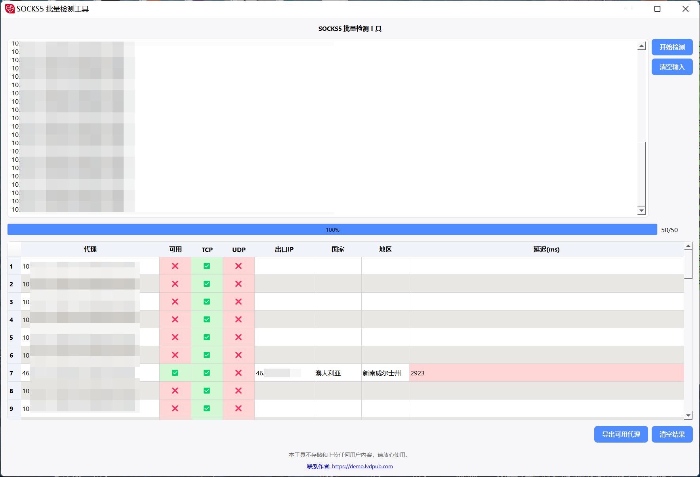

# SOCKS5 批量检测工具

<div align="center">


一个功能强大的SOCKS5代理批量检测工具，支持协议检测、地理位置查询和结果导出。

</div>

## 效果预览

<div align="center">

### 主界面

*简洁直观的用户界面，支持批量输入代理信息*

### 检测结果

*支持导出可用节点到Excel文件*

</div>


## 📋 目录

- [功能特点](#-功能特点)
- [系统要求](#-系统要求)
- [安装指南](#-安装指南)
- [使用说明](#-使用说明)
- [构建可执行文件](#-构建可执行文件)
- [技术栈](#-技术栈)
- [项目结构](#-项目结构)
- [常见问题](#-常见问题)
- [贡献指南](#-贡献指南)
- [许可证](#-许可证)
- [联系方式](#-联系方式)

## ✨ 功能特点

### 核心功能
- 🔍 **批量检测** - 支持同时检测多个SOCKS5代理的可用性
- 🌐 **协议支持检测** - 检测代理的TCP和UDP协议支持情况
- 📍 **地理位置查询** - 显示代理出口IP的国家和地区信息
- ⚡ **延迟测试** - 测量代理连接延迟，支持延迟分级显示
- 🔄 **多重试机制** - 3次重试机制提高检测准确性

### 用户界面
- 🎨 **现代化UI** - 基于PyQt5的美观界面设计
- 📊 **实时进度** - 实时显示检测进度和状态
- 🎯 **状态指示** - 直观的✅❌状态显示
- 🎨 **颜色编码** - 根据延迟和状态进行颜色分级

### 数据处理
- 📋 **多格式支持** - 支持 `ip:port:user:pass` 和 `ip|port|user|pass` 两种格式
- 📄 **结果导出** - 支持CSV和TXT格式导出可用代理
- 📋 **复制功能** - 双击或右键菜单复制代理信息
- 🗂️ **批量操作** - 支持批量复制和导出操作

## 💻 系统要求

- **操作系统**: Windows 7+, macOS 10.12+, Linux (Ubuntu 16.04+)
- **Python版本**: Python 3.7 或更高版本
- **内存**: 至少 512MB RAM
- **存储空间**: 至少 100MB 可用空间
- **网络**: 稳定的互联网连接

## 🚀 安装指南

### 方法一：使用预编译版本（推荐）

1. 从 [Releases](../../releases) 页面下载最新版本的可执行文件
2. 解压下载的文件
3. 双击运行 `SOCKS5批量检测工具.exe`

### 方法二：从源码运行

1. **克隆仓库**
   ```bash
   git clone https://github.com/your-username/socks5-batch-checker.git
   cd socks5-batch-checker
   ```

2. **安装依赖**
   ```bash
   pip install -r requirements.txt
   ```

3. **下载GeoIP数据库**
   - 从 [MaxMind官网](https://dev.maxmind.com/geoip/geolite2-free-geolocation-data) 下载 `GeoLite2-City.mmdb`
   - 将文件放置在项目根目录

4. **运行程序**
   ```bash
   python check.py
   ```

## 📖 使用说明

### 基本使用流程

1. **启动程序**
   - 双击可执行文件或运行Python脚本

2. **输入代理信息**
   - 在文本框中输入代理信息，每行一个
   - 支持两种格式：
     - `ip:port:username:password`
     - `ip|port|username|password`
   - 无认证代理格式：`ip:port` 或 `ip|port`

3. **开始检测**
   - 点击"开始检测"按钮
   - 程序将并发检测所有代理（最多5个并发）

4. **查看结果**
   - 检测结果实时显示在表格中
   - 包含以下信息：
     - 代理地址
     - 可用状态（✅/❌）
     - TCP支持（✅/❌）
     - UDP支持（✅/❌）
     - 出口IP地址
     - 国家/地区
     - 连接延迟

5. **导出结果**
   - 点击"导出可用代理"按钮
   - 选择CSV或TXT格式
   - 仅导出检测成功的代理

### 高级功能

#### 复制功能
- **双击复制**: 双击任意单元格复制内容到剪贴板
- **右键菜单**: 右键点击选择复制选项
- **批量复制**: 选择多个单元格后右键复制

#### 状态说明
- **可用状态**: 代理是否能够正常连接和使用
- **TCP状态**: 代理是否支持TCP连接
- **UDP状态**: 代理是否支持UDP协议
- **延迟颜色**:
  - 🟢 绿色: < 300ms (优秀)
  - 🟡 黄色: 300-1000ms (良好)
  - 🔴 红色: > 1000ms (较慢)

## 🔨 构建可执行文件

### 准备工作

1. **确保所有依赖已安装**
   ```bash
   pip install -r requirements.txt
   ```

2. **准备必要文件**
   - `GeoLite2-City.mmdb` - GeoIP数据库文件
   - `app_icon.ico` - 应用程序图标（可选）

### 构建步骤

1. **运行构建脚本**
   ```bash
   python build.py
   ```

2. **构建完成**
   - 可执行文件将生成在 `dist` 目录中
   - 文件名: `SOCKS5批量检测工具.exe`

### 构建选项说明

构建脚本会自动：
- 清理旧的构建文件
- 包含GeoIP数据库
- 设置应用程序图标
- 创建单文件可执行程序
- 验证构建结果

## 🛠️ 技术栈

### 核心技术
- **GUI框架**: PyQt5 - 跨平台图形用户界面
- **网络库**: requests - HTTP请求处理
- **地理位置**: geoip2 - IP地理位置查询
- **并发处理**: concurrent.futures - 多线程并发检测
- **打包工具**: PyInstaller - 可执行文件打包

### 依赖库
```
PyQt5>=5.15.0          # GUI框架
requests>=2.25.0       # HTTP请求
geoip2>=4.1.0          # GeoIP查询
pyinstaller>=4.5.0     # 打包工具
```

### 架构设计
- **MVC模式**: 分离界面、逻辑和数据
- **多线程**: 使用QThread进行后台检测
- **线程池**: ThreadPoolExecutor管理并发任务
- **信号槽**: PyQt5信号槽机制进行线程通信

## 📁 项目结构

```
socks5-batch-checker/
├── check.py                    # 主程序文件
├── build.py                    # 构建脚本
├── requirements.txt            # 依赖列表
├── LICENSE                     # Apache 2.0许可证
├── README.md                   # 项目说明
├── app_icon.ico               # 应用图标
├── GeoLite2-City.mmdb         # GeoIP数据库
├── dist/                      # 构建输出目录
├── build/                     # 构建临时目录
└── backup_data/               # 备份数据目录
```

## ❓ 常见问题

### Q: 为什么有些代理显示TCP可用但SOCKS5不可用？
A: TCP连接成功只表示网络连通性，SOCKS5协议需要正确的握手和认证过程。TCP测试和SOCKS5测试是两个不同的检测层面。

### Q: UDP检测是如何工作的？
A: 当前的UDP检测是通过SOCKS5代理发送HTTP请求来模拟的。真正的UDP功能测试需要专门的STUN服务器或DNS查询。

### Q: 为什么检测速度较慢？
A: 为了确保准确性，程序采用了3次重试机制，并且限制了并发数量（5个）以避免对目标服务器造成过大压力。

### Q: GeoIP数据库文件在哪里获取？
A: 可以从 [MaxMind官网](https://dev.maxmind.com/geoip/geolite2-free-geolocation-data) 免费下载GeoLite2-City.mmdb文件。

### Q: 程序无法启动怎么办？
A: 请检查：
1. Python版本是否为3.7+
2. 所有依赖是否正确安装
3. GeoLite2-City.mmdb文件是否存在
4. 防火墙是否阻止了程序运行

### Q: 如何提高检测准确性？
A: 建议：
1. 确保网络连接稳定
2. 避免同时运行其他网络密集型程序
3. 如果检测结果不准确，可以多次运行检测

## 🤝 贡献指南

我们欢迎所有形式的贡献！

### 如何贡献

1. **Fork 项目**
2. **创建特性分支** (`git checkout -b feature/AmazingFeature`)
3. **提交更改** (`git commit -m 'Add some AmazingFeature'`)
4. **推送到分支** (`git push origin feature/AmazingFeature`)
5. **创建 Pull Request**

### 贡献类型

- 🐛 Bug修复
- ✨ 新功能开发
- 📝 文档改进
- 🎨 UI/UX改进
- ⚡ 性能优化
- 🧪 测试用例

### 开发规范

- 遵循PEP 8代码风格
- 添加适当的注释和文档
- 确保代码通过现有测试
- 新功能需要添加相应测试

## 📄 许可证

本项目采用 Apache License 2.0 许可证。详细信息请查看 [LICENSE](LICENSE) 文件。

```
Copyright 2024 SOCKS5 Batch Checker

Licensed under the Apache License, Version 2.0 (the "License");
you may not use this file except in compliance with the License.
You may obtain a copy of the License at

    http://www.apache.org/licenses/LICENSE-2.0

Unless required by applicable law or agreed to in writing, software
distributed under the License is distributed on an "AS IS" BASIS,
WITHOUT WARRANTIES OR CONDITIONS OF ANY KIND, either express or implied.
See the License for the specific language governing permissions and
limitations under the License.
```

## 📞 联系方式

- **项目主页**: [https://demo.lvdpub.com](https://demo.lvdpub.com)
- **问题反馈**: 请在GitHub Issues中提交
- **功能建议**: 欢迎在Issues中讨论新功能

---

<div align="center">

**如果这个项目对您有帮助，请给它一个 ⭐ Star！**

Made with ❤️ by SOCKS5 Batch Checker Team

</div> 